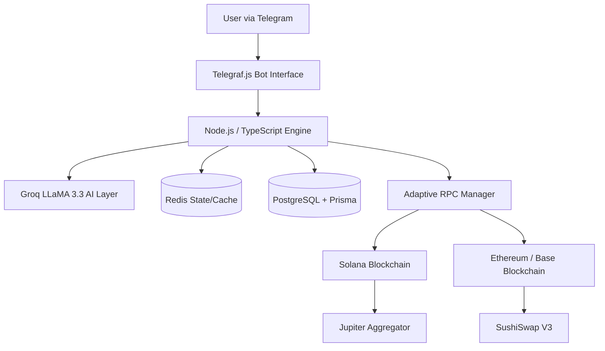

# 🚀 SolBot V3 — Multi-Chain Automated Trading Engine (Alpha)

<div align="center">


### ⚡ Secure, AI-Powered DeFi Trading Bot with Real-Time Execution

**SolBot V3** is a production-grade trading engine that enables **automated trading, portfolio management, and token launches** across Solana, Ethereum, and Base, featuring **secure key handling and real-time monitoring via Telegram**.

---

## 🎥 Demo Video

👉 Watch the bot in action: https://youtu.be/lnwwbN_f3Yg?si=o-x079ibP0ZT5v9B

## 🔗 Live Demo

👉 Try the bot here: https://t.me/ArmEthSol_bot

</div>

---

## ⚠️ Alpha & Legal Notice
SolBot V3 is currently in **Alpha**. For legal and compliance testing, the bot is configured to operate in **Simulation Mode** on all Devnet/Testnet environments. 

### Testing Swaps on Devnet
Because decentralized exchanges (DEXs) like Raydium and Jupiter do not have active liquidity pools on Solana Devnet, the bot uses a **Functional Simulation**:
*   **Solana Devnet:** Executing a swap will generate a mock price quote and perform a real transaction on the Solana Devnet (transferring a nominal 1000 lamports to the treasury) to verify the wallet's signing and transmission capabilities.
*   **Ethereum/Base Sepolia:** Executing a swap will perform a test transaction on the Sepolia network. You will need **Sepolia ETH** from a faucet to test this.

---

## ⚡ Key Highlights (V3)

* 🌐 **Multi-Chain Core**: Native architecture for **Solana**, **Ethereum**, and **Base**.
* 🤖 **Automated Token Swaps**: Integrated with **Jupiter** (Solana) and **SushiSwap** (EVM) with simulation support for devnets.
* 📡 **Adaptive RPC Engine**: Real-time latency tracking and automatic failover to the fastest available RPC node.
* 🔐 **Enterprise-Grade Security**: AES-256-CBC encrypted key management with unique IVs per wallet.
* 🧠 **AI Assistant**: Natural language processing powered by **Groq (LLaMA 3.3 70B)** for trading and portfolio insights.
* 💼 **Multi-Wallet Management**: Create and manage multiple wallets across different chains from a single interface.
* 🚀 **One-Click SPL Token Launch**: Integrated with Metaplex and Pinata (IPFS) for instant token deployment.
* 📈 **Advanced Features**: Real-time price alerts, watchlist tracking, and transaction history.
* 👥 **Referral System**: Built-in referral program to incentivize user growth.
* ⚡ **High Performance**: Redis-backed global state management and caching.

---

## 🧠 System Architecture



---

## 🛠️ Tech Stack

- **Runtime**: Node.js, Bun
- **Language**: TypeScript
- **Bot Framework**: Telegraf.js
- **Blockchain**: 
  - Solana: `@solana/web3.js`, `@solana/spl-token`, `@metaplex-foundation/umi`
  - EVM: `ethers.js` (v6)
- **Database**: PostgreSQL + Prisma ORM
- **Cache/State**: Redis (Upstash)
- **AI**: Groq SDK (LLaMA 3.3 70B)
- **Storage**: Pinata (IPFS) for token metadata
- **DevOps**: Docker, Docker Compose

---

## ⚙️ Configuration

Copy `.env.example` to `.env` and fill in your credentials:

| Variable | Description |
|----------|-------------|
| `BOT_TOKEN` | Your Telegram Bot Token from @BotFather |
| `ENCRYPTION_KEY` | 64-character hex key for AES-256 encryption |
| `DATABASE_URL` | PostgreSQL connection string |
| `NETWORK_TYPE` | `mainnet` or `devnet` |
| `GROQ_API_KEY` | API key for AI features |
| `PINATA_API_KEY/SECRET` | For IPFS metadata storage |
| `RPC_URLS` | Custom RPC endpoints for Solana, ETH, and Base |

---

## 🚀 Getting Started

### Docker (Recommended)

```bash
docker-compose up -d
```

### Local Setup

1. **Install dependencies**:
   ```bash
   npm install
   ```

2. **Initialize Database**:
   ```bash
   npx prisma db push
   ```

3. **Start Development Server**:
   ```bash
   npm run dev
   ```

---

## 📁 Project Structure

```text
src/
 ├── commands/        # Telegram command handlers (wallet, swap, ai, alerts, referral)
 ├── services/        # Core logic (Solana, EVM, Jupiter, RPC, AI, DB, Redis)
 ├── utils/           # Encryption, crypto helpers, and shared utilities
 ├── types/           # TypeScript interfaces and types
 └── bot.ts           # Bot initialization and middleware
scripts/              # Utility scripts for maintenance and testing
prisma/               # Database schema and migrations
```

---

## 🛠️ Utility Scripts & Health Checks

### Maintenance Scripts
The project includes several CLI scripts in the `scripts/` directory:
- `npm run generate-key`: Generate a secure encryption key for your `.env`.
- `tsx scripts/migrate-multi-wallet.ts`: Migrate legacy single-wallet users to the new multi-wallet system.
- `tsx scripts/test-rpc.ts`: Test and benchmark configured RPC endpoints.
- `tsx scripts/verify-balance.ts`: Debugging tool for checking wallet balances across chains.

### Monitoring
- **Health Check**: The bot exposes a JSON health check endpoint on the configured `PORT` (default 3000).
- **Price Alerts**: A background `AlertChecker` process monitors token prices and notifies users in real-time.

---

## 👨‍💻 Author

**Armaan Saxena**
GitHub: [Armaansaxena](https://github.com/Armaansaxena)

---

<div align="center">

⭐ Star this repo if you find it valuable!

</div>
